# Time Series Graphics


## 2.2 Time Plots

### Setup

``` r
library(tidyverse)
library(tsibble)
library(fpp3)
library(ggtime)
```

### Simple graph

``` r
head(ansett) #passenger numbers on Ansett airline flights
```

    # A tsibble: 6 x 4 [1W]
    # Key:       Airports, Class [1]
          Week Airports Class    Passengers
        <week> <chr>    <chr>         <dbl>
    1 1989 W28 ADL-PER  Business        193
    2 1989 W29 ADL-PER  Business        254
    3 1989 W30 ADL-PER  Business        185
    4 1989 W31 ADL-PER  Business        254
    5 1989 W32 ADL-PER  Business        191
    6 1989 W33 ADL-PER  Business        136

``` r
melsyd_economy <- ansett |> 
  filter(Airports == "MEL-SYD", Class=="Economy") |> 
  mutate(Passengers = Passengers/1000) 

autoplot(melsyd_economy) + 
  labs(
    title="Ansett arilines economy class",
    subtitle="Melbourne-Sydney",
    y="Passengers (k)"
  )
```

    Plot variable not specified, automatically selected `.vars = Passengers`

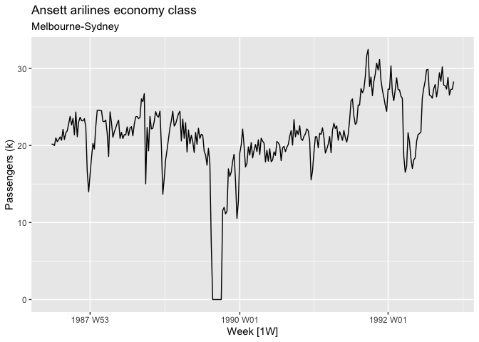

``` r
head(PBS)
```

    # A tsibble: 6 x 9 [1M]
    # Key:       Concession, Type, ATC1, ATC2 [1]
         Month Concession   Type       ATC1  ATC1_desc ATC2  ATC2_desc Scripts  Cost
         <mth> <chr>        <chr>      <chr> <chr>     <chr> <chr>       <dbl> <dbl>
    1 1991 Jul Concessional Co-paymen… A     Alimenta… A01   STOMATOL…   18228 67877
    2 1991 Aug Concessional Co-paymen… A     Alimenta… A01   STOMATOL…   15327 57011
    3 1991 Sep Concessional Co-paymen… A     Alimenta… A01   STOMATOL…   14775 55020
    4 1991 Oct Concessional Co-paymen… A     Alimenta… A01   STOMATOL…   15380 57222
    5 1991 Nov Concessional Co-paymen… A     Alimenta… A01   STOMATOL…   14371 52120
    6 1991 Dec Concessional Co-paymen… A     Alimenta… A01   STOMATOL…   15028 54299

``` r
a10 <- PBS |>
  filter(ATC2 == "A10") |>
  select(Month, Concession, Type, Cost) |>
  summarise(TotalC = sum(Cost)) |>
  mutate(Cost = TotalC / 1e6) -> a10

autoplot(a10, Cost) +
  labs(y="$ (millions)",
       title = "Australian antidiabetic drug sales")
```

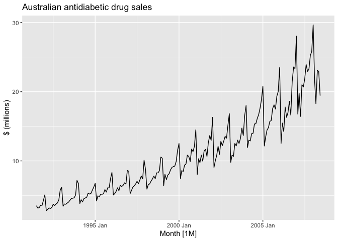

## 2.4 Seasonal Plot

``` r
a10 |> 
  gg_season(Cost, labels="both") +
  labs(y="$M", title="Seasonal plot: Antidiabetic drug sales")
```

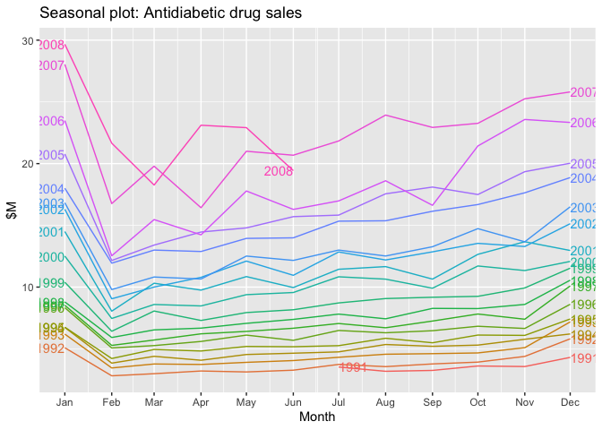

``` r
head(vic_elec)
```

    # A tsibble: 6 x 5 [30m] <Australia/Melbourne>
      Time                Demand Temperature Date       Holiday
      <dttm>               <dbl>       <dbl> <date>     <lgl>  
    1 2012-01-01 00:00:00  4383.        21.4 2012-01-01 TRUE   
    2 2012-01-01 00:30:00  4263.        21.0 2012-01-01 TRUE   
    3 2012-01-01 01:00:00  4049.        20.7 2012-01-01 TRUE   
    4 2012-01-01 01:30:00  3878.        20.6 2012-01-01 TRUE   
    5 2012-01-01 02:00:00  4036.        20.4 2012-01-01 TRUE   
    6 2012-01-01 02:30:00  3866.        20.2 2012-01-01 TRUE   

``` r
vic_elec |> 
  gg_season(Demand, period="week") +
  theme(legend.position = "none") +
  labs(y="MWh", title="Electicity demand: Victoria")
```

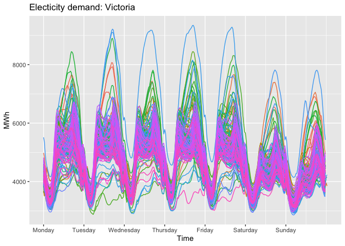

### 2.5 Seasonal subqueries plot

``` r
a10 |> 
  gg_subseries(Cost) +
  labs(y="$ M", title="Australian antidiabetic drug sales")
```

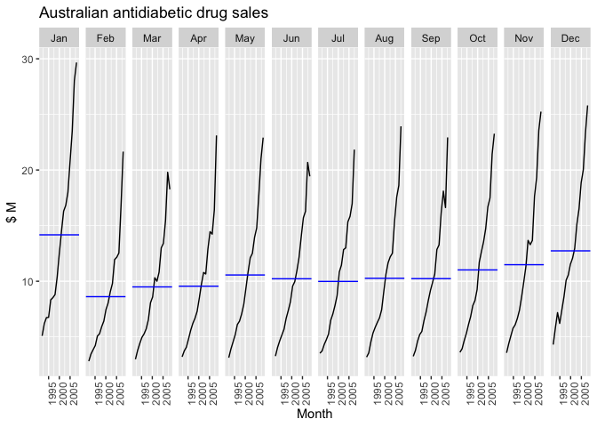

### Example: Australian Holiday Tourism

``` r
head(tourism)
```

    # A tsibble: 6 x 5 [1Q]
    # Key:       Region, State, Purpose [1]
      Quarter Region   State           Purpose  Trips
        <qtr> <chr>    <chr>           <chr>    <dbl>
    1 1998 Q1 Adelaide South Australia Business  135.
    2 1998 Q2 Adelaide South Australia Business  110.
    3 1998 Q3 Adelaide South Australia Business  166.
    4 1998 Q4 Adelaide South Australia Business  127.
    5 1999 Q1 Adelaide South Australia Business  137.
    6 1999 Q2 Adelaide South Australia Business  200.

``` r
holidays <- tourism |> 
  filter(Purpose=="Holiday") |> 
  group_by(State) |> 
  summarise(Trips=sum(Trips))

head(holidays)
```

    # A tsibble: 6 x 3 [1Q]
    # Key:       State [1]
      State Quarter Trips
      <chr>   <qtr> <dbl>
    1 ACT   1998 Q1  196.
    2 ACT   1998 Q2  127.
    3 ACT   1998 Q3  111.
    4 ACT   1998 Q4  170.
    5 ACT   1999 Q1  108.
    6 ACT   1999 Q2  125.

``` r
autoplot(holidays, Trips) +
  labs(
    y="Overnight trips (k)",
    title="Australian Domestic Holidays"
  )
```

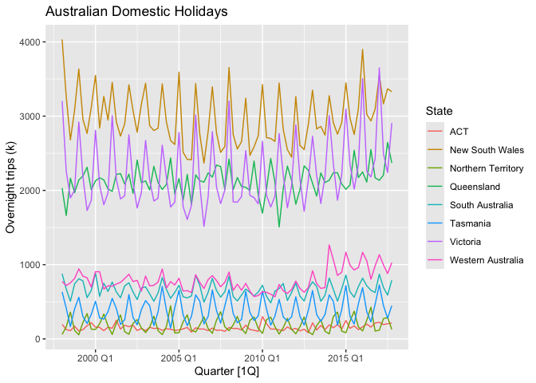

To see the timing of the seasonal peaks in each state, we can use a
season plot. Figure
[2.10](https://otexts.com/fpp3/subseries.html#fig:holidaysseason) makes
it clear that the southern states of Australia (Tasmania, Victoria and
South Australia) have strongest tourism in Q1 (their summer), while the
northern states (Queensland and the Northern Territory) have the
strongest tourism in Q3 (their dry season).

``` r
gg_season(holidays, Trips) +
  labs(y = "Overnight trips ('000)",
       title = "Australian domestic holidays")
```

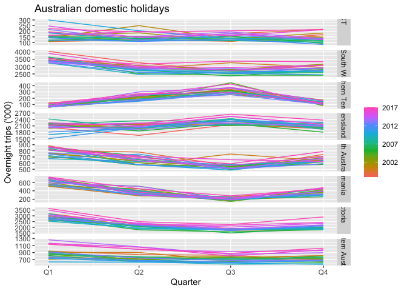

``` r
holidays |> 
  gg_subseries(Trips)
```

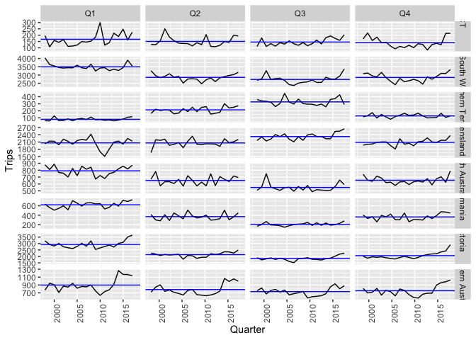

### 2.6 Scatter Plot

``` r
head(vic_elec)
```

    # A tsibble: 6 x 5 [30m] <Australia/Melbourne>
      Time                Demand Temperature Date       Holiday
      <dttm>               <dbl>       <dbl> <date>     <lgl>  
    1 2012-01-01 00:00:00  4383.        21.4 2012-01-01 TRUE   
    2 2012-01-01 00:30:00  4263.        21.0 2012-01-01 TRUE   
    3 2012-01-01 01:00:00  4049.        20.7 2012-01-01 TRUE   
    4 2012-01-01 01:30:00  3878.        20.6 2012-01-01 TRUE   
    5 2012-01-01 02:00:00  4036.        20.4 2012-01-01 TRUE   
    6 2012-01-01 02:30:00  3866.        20.2 2012-01-01 TRUE   

``` r
vic_elec |> 
  filter(year(Time)==2014) |> 
  autoplot(Demand) +
  labs(y="GW", title="Half-hour eletricity demand: Victoria")
```

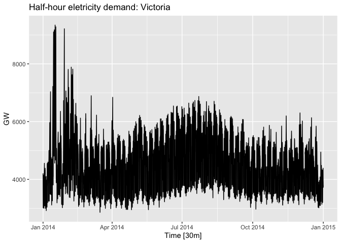

``` r
vic_elec |> 
  filter(year(Time)==2014) |> 
  autoplot(Temperature) +
  labs(y="°C", title="Half-hour eletricity demand: Victoria")
```

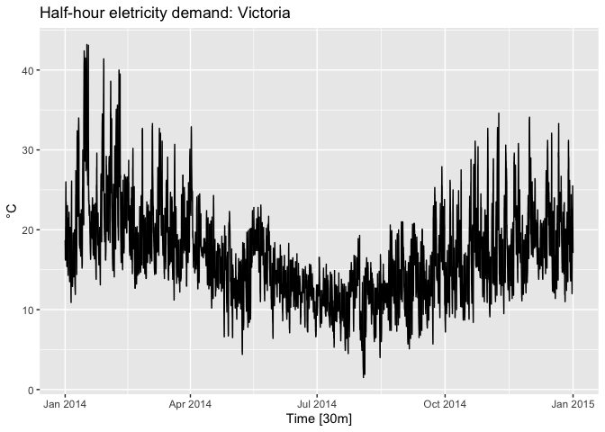

``` r
vic_elec |> 
  filter(year(Time)==2014) |> 
  ggplot(aes(x=Temperature, y=Demand)) +
  geom_point(alpha=.5, colour="darkblue") +
  theme_light() +
  labs(x="°C", y="GW")
```

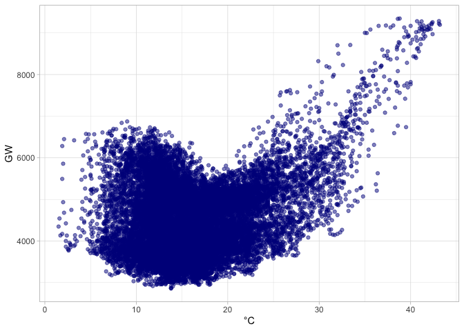

#### Scatter Plot Matrices

``` r
head(tourism)
```

    # A tsibble: 6 x 5 [1Q]
    # Key:       Region, State, Purpose [1]
      Quarter Region   State           Purpose  Trips
        <qtr> <chr>    <chr>           <chr>    <dbl>
    1 1998 Q1 Adelaide South Australia Business  135.
    2 1998 Q2 Adelaide South Australia Business  110.
    3 1998 Q3 Adelaide South Australia Business  166.
    4 1998 Q4 Adelaide South Australia Business  127.
    5 1999 Q1 Adelaide South Australia Business  137.
    6 1999 Q2 Adelaide South Australia Business  200.

``` r
visitors <- tourism |> 
  group_by(State) |> 
  summarise(Trips=sum(Trips))

visitors |> 
  ggplot(aes(x=Quarter, y=Trips)) +
  geom_line() +
  facet_grid(vars(State), scales="free_y") +
  labs(title = "Australian domestic tourism",
       y= "Overnight trips (k)")
```

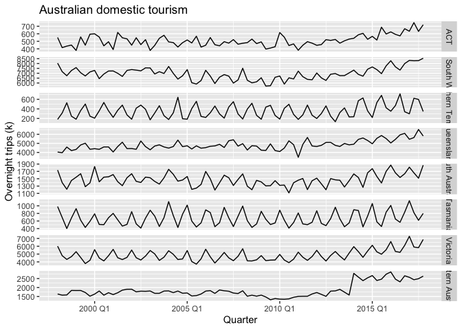

``` r
visitors |> 
  pivot_wider(values_from=Trips, names_from = State) |> 
  GGally::ggpairs(columns=2:9)
```

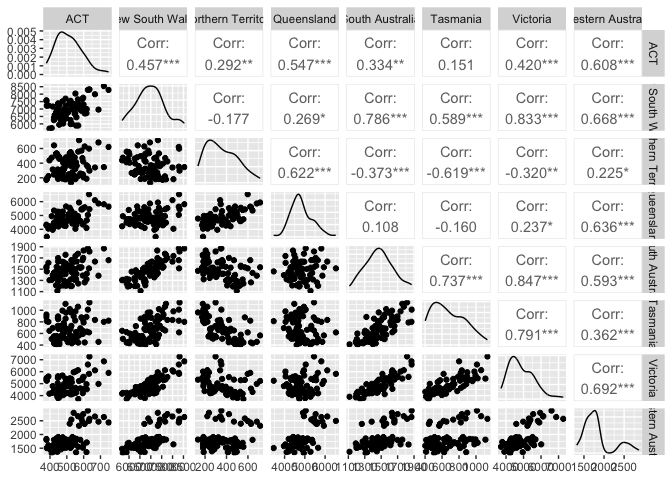

## 2.7 Lag plots

``` r
head(aus_production)
```

    # A tsibble: 6 x 7 [1Q]
      Quarter  Beer Tobacco Bricks Cement Electricity   Gas
        <qtr> <dbl>   <dbl>  <dbl>  <dbl>       <dbl> <dbl>
    1 1956 Q1   284    5225    189    465        3923     5
    2 1956 Q2   213    5178    204    532        4436     6
    3 1956 Q3   227    5297    208    561        4806     7
    4 1956 Q4   308    5681    197    570        4418     6
    5 1957 Q1   262    5577    187    529        4339     5
    6 1957 Q2   228    5651    214    604        4811     7

``` r
recent_production <- aus_production |> 
  filter(year(Quarter) >= 2000)

recent_production |> 
  gg_lag(Beer, geom = "point") +
  labs(x="lag(Beer, k)")
```

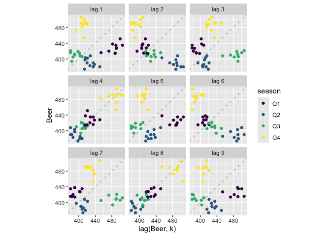

The relationship is strongly positive at lags 4 and 8, reflecting the
strong seasonality in the data. The negative relationship seen for lags
2 and 6 ocurrs because peaks (in Q4) are plotted against trughs (in Q2)

## 2.8 Autocorrelation

Just as correlation measures the extent of a linear relationship between
two variables, autocorrelation measures the linear relationship between
*lagged values* of a time series.

``` r
recent_production |> 
  ACF(Beer, lag_max=9)
```

    # A tsibble: 9 x 2 [1Q]
           lag      acf
      <cf_lag>    <dbl>
    1       1Q -0.0530 
    2       2Q -0.758  
    3       3Q -0.0262 
    4       4Q  0.802  
    5       5Q -0.0775 
    6       6Q -0.657  
    7       7Q  0.00119
    8       8Q  0.707  
    9       9Q -0.0888 

The values in the ACF column are the “r” corresponding to the ninge
scatterplots before.

``` r
recent_production |> 
  ACF(Beer) |> 
  autoplot() +
  labs(title="Australian beer production")
```

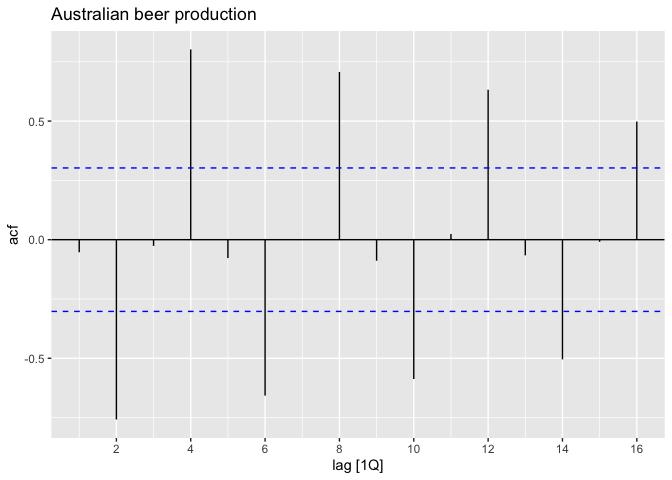

Graphic visualization of r values, the dashed blue lines indicate
whether the correlations are significantly different from zero.

### Trend and seasonality in ACF plots

When data have a trend, the autocorrelations for small lags tend to be
large and positive because observations nearby in time are also nearby
in value. So the ACF of a trended time series tends to have positive
values that slowly decrease as the lags increase.

When data are seasonal, the autocorrelations will be larger for the
seasonal lags (at multiples of the seasonal period) than for other lags.

When data are both trended and seasonal, you see a combination of these
effects.

``` r
a10 |> 
  ACF(Cost, lag_max=48) |> 
  autoplot() +
  labs(title="Australian antidiabetic drug sales")
```

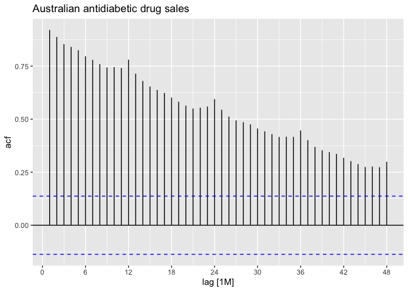

## 2.9 White noise

Time series that show no autocorrelation are called white noise

``` r
set.seed(30)
y <- tsibble(sample=1:50, wn=rnorm(50), index=sample)
y |> 
  autoplot(wn) +
  labs(title="white noise", y="")
```

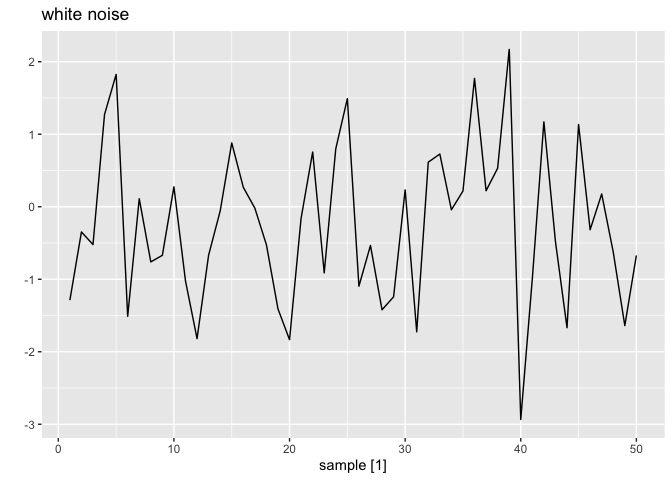

``` r
y |> 
  ACF(wn) |> 
  autoplot() +
  labs(title="White Noise")
```

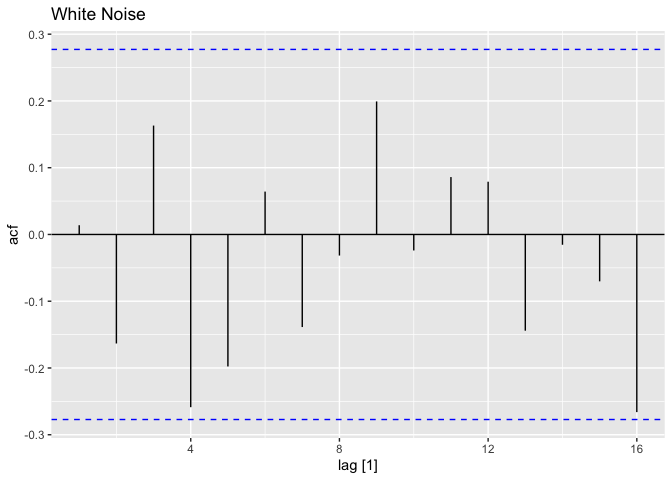

### site quest: is dollar white noise?

``` r
library(rbcb)
dollar <- get_series(1, start_date=dmy(25112020)) |> 
  set_names(c("date", "price")) |> 
  as_tsibble(index=date)

head(dollar)
```

    # A tsibble: 6 x 2 [1D]
      date       price
      <date>     <dbl>
    1 2020-11-25  5.35
    2 2020-11-26  5.32
    3 2020-11-27  5.35
    4 2020-11-30  5.33
    5 2020-12-01  5.28
    6 2020-12-02  5.23

``` r
dollar |> 
  autoplot() +
  labs(title="PTAX Series", y="R$", x="date")
```

    Plot variable not specified, automatically selected `.vars = price`

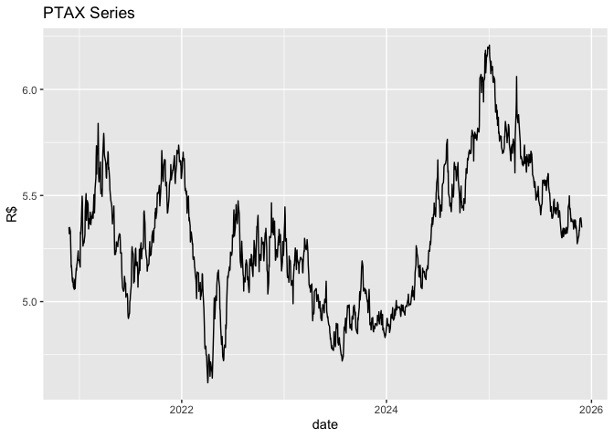

``` r
dollar |> 
  gg_lag(y=price, lags = 1:30, geom = "point")
```

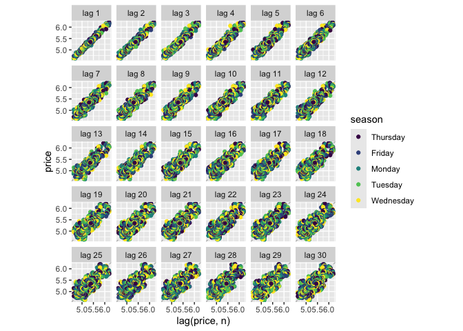

``` r
dollar |> 
  mutate(index=row_number()) |> 
  as_tsibble(index=index) |> 
  ACF(lag_max = 3*365) |> 
  autoplot()
```

    Response variable not specified, automatically selected `var = date`

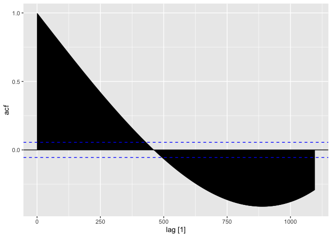

## 2.10 Exercises

### Number 3

``` r
tute <- read_csv("../data/tute1.csv") |> 
  janitor::clean_names()
```

    Rows: 100 Columns: 4
    ── Column specification ────────────────────────────────────────────────────────
    Delimiter: ","
    dbl  (3): Sales, AdBudget, GDP
    date (1): Quarter

    ℹ Use `spec()` to retrieve the full column specification for this data.
    ℹ Specify the column types or set `show_col_types = FALSE` to quiet this message.

``` r
head(tute)
```

    # A tibble: 6 × 4
      quarter    sales ad_budget   gdp
      <date>     <dbl>     <dbl> <dbl>
    1 1981-03-01 1020.      659.  252.
    2 1981-06-01  889.      589   291.
    3 1981-09-01  795       512.  291.
    4 1981-12-01 1004.      614.  292.
    5 1982-03-01 1058.      647.  279.
    6 1982-06-01  944.      602   254 

``` r
myts <- tute |> 
  mutate(quarter = yearquarter(quarter)) |> 
  as_tibble(index=quarter)
  
myts |> 
  pivot_longer(cols=-quarter) |> 
  ggplot(aes(x=quarter, y=value, color=name)) +
  geom_line() +
  facet_grid(name~., scales="free_y") +
  theme_minimal()
```

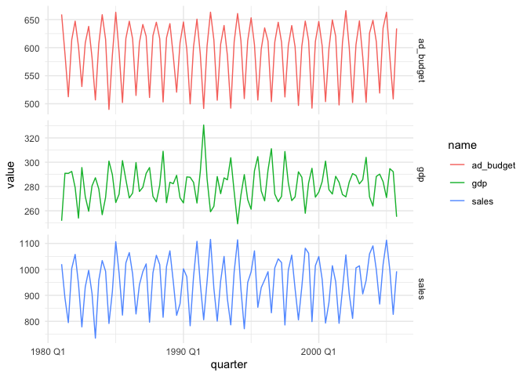
